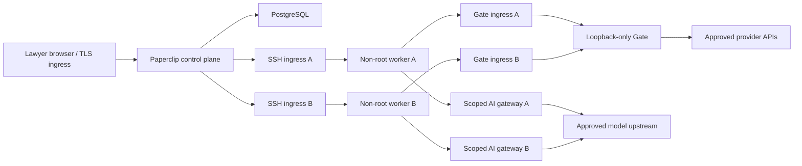

# Firm single-tenant isolation reference

This directory is a customer-controlled Docker Compose reference for one firm or one in-house legal department. It separates Paperclip and the Gate from two non-root SSH execution workers, gives each worker its own identity, workspace, state, Gate credential, and AI-gateway credential, and includes a sacrificial isolation eval.

It is fail-closed by default: the included AI gateway is an authenticated health probe that returns `503` for every model request. Replace it with an independently reviewed, authenticated model gateway before enabling agent work.

## Status and scope

The static topology and staging contracts are executable. A Docker-capable host must still run the Compose build, Paperclip SSH environment probe, and sacrificial isolation eval. Do not describe this deployment as production-ready until every release gate below passes.

This reference does not modify the pinned `paperclip/` submodule. It uses Paperclip's supported SSH environment API and sets each selected agent's `defaultEnvironmentId`.



The two worker networks are distinct. Paperclip never joins either worker network. Interface-bound relays let Paperclip initiate SSH and let each worker reach the Gate, without creating a general router between networks. Relays run without capabilities, secrets, a writable root filesystem, or IP-forwarding privileges.

## Security properties implemented here

- Workers run as UID/GID `10001`, with a read-only root filesystem, all Linux capabilities dropped, `no-new-privileges`, a private PID namespace, and writable `tmpfs` only for runtime paths.
- Each worker has a distinct SSH client key, SSH host key/state volume, workspace volume, Gate agent key, AI-gateway key, and internal network.
- No Docker socket, host repository bind mount, control-plane secret, database secret, or provider credential is mounted into a worker.
- SSH accepts Ed25519 keys only. The installed authorization line uses OpenSSH `restrict`; forwarding, PTY, user rc, password login, and user-controlled environment files are disabled.
- Worker networks are `internal: true`, so workers cannot connect directly to internet providers. The Gate and each AI-gateway boundary join a distinct provider-egress network; the three boundary services do not share that network with one another.
- The Gate continues to bind `127.0.0.1` inside its container. A loopback relay exposes it only to interface-bound per-worker Gate ingress relays; no Gate port is published on the host.
- Paperclip and SSH ingress are published only on host loopback. A production TLS reverse proxy is an external prerequisite.
- Paperclip's heartbeat/callback credential remains `PAPERCLIP_API_KEY`. Gate calls use `POSSIBLAW_GATE_API_KEY_FILE` through `possiblaw-gate-request`; the isolation eval proves the two credential values differ.
- The workspace stager copies an explicit allowlist only. It rejects traversal, symlinks, hard links, non-regular files, oversized content, and nested secret-like names, and writes a SHA-256 manifest.
- The isolation probe emits JSON whose values are only booleans or SHA-256 hashes. It never returns environment values, credential hashes, file contents, command lines, addresses, or vendor responses.

## What Compose cannot prove

Docker Compose is not a security boundary against a Docker-daemon administrator, host root, kernel compromise, malicious base image, or a compromised boundary service. Its bridge networks are not a domain-aware egress firewall.

The following controls are therefore mandatory production prerequisites:

1. Run one tenant on a dedicated, patched Linux VM or stronger isolated runtime. Use a different VM/project for another company or ethical wall; do not rely on service names or Compose projects as the only cross-company boundary.
2. Put a host firewall or authenticated egress proxy in front of all three provider-egress networks. Allow only the exact Gate/provider and model-gateway upstreams required by policy. The Compose file intentionally makes no false SNI/domain-filtering claim.
3. Replace both blocked AI-gateway services with reviewed per-worker (or equivalently scoped) gateways that hold provider credentials outside workers, authenticate the worker's scoped key, enforce model/budget policy, bound request/response size and time, and produce audit receipts.
4. Terminate TLS in a reviewed reverse proxy, preserve authenticated/private Paperclip mode, and expose only the proxy. The default loopback publication is for bootstrap and attestation.
5. Pin every base image by digest and record the built image digests/SBOM. The pinned Paperclip Dockerfile currently installs some control-container CLIs with floating package tags; those CLIs must not be used for execution, and the final server image digest must be captured before release.
6. Replace file-backed Compose secrets with the firm's secret manager or encrypted host storage and restrict Docker-daemon access. File-backed secrets are mounted read-only but are not encrypted by Compose.
7. Configure backup/restore, receipt retention/anchoring, log shipping/redaction, monitoring, patching, and incident response.
8. Run the two-lawyer, live provider/readback, restore, and external/WORM receipt tests tracked by the project. The foreign sentinel proves network non-membership only; it does not replace an authenticated cross-account Paperclip test.

## Tool contract

Reference versions are explicit in the build files:

- Node worker and Gate: `24.18.0`
- Codex CLI in workers: `0.144.1`
- Claude Code in workers: `2.1.208`
- PostgreSQL image tag: `17.5-alpine3.22`
- Alpine relay tag: `3.22.1`
- Python probe tag: `3.14.0-alpine3.22`

Tags are still mutable registry references. Resolve and substitute organization-approved `@sha256:` image references before production.

## Bootstrap sequence

Prerequisites: Docker Engine with Compose v2, Python 3, `curl`, `jq`, OpenSSH client tools, `openssl`, Node 24.18.0, and pnpm 9.15.4.

1. Create local configuration and private bootstrap material:

   ```sh
   cd /absolute/path/to/possiblaw/deployments/firm-single-tenant
   cp .env.example .env
   ./scripts/init-secrets.sh
   ```

   `.env`, `.secrets/`, `runtime/`, and `staging/` are ignored in this directory. Do not put a board token or provider token in `.env`.

2. Start only the database and authenticated Paperclip control plane:

   ```sh
   docker compose up -d db paperclip
   docker compose ps
   ```

3. Complete the first authenticated Paperclip board-claim/login flow on `http://127.0.0.1:3100`. Obtain a board bearer token without placing it on a command line. Export it only in the operator shell:

   ```sh
   export PAPERCLIP_API_KEY='board-token-from-the-approved-flow'
   ```

4. Preview, then import the PossibLaw company package through the pinned Paperclip CLI. Capture the successful portability import response immediately as a private artifact; it is the only trusted source of package slug to immutable agent-ID bindings:

   ```sh
   cd /absolute/path/to/possiblaw
   PAPERCLIP_API_URL=http://127.0.0.1:3100 \
     pnpm -C paperclip paperclipai company import ../companies/legal-operations \
       --target new --dry-run --json

   umask 077
   import_response=deployments/firm-single-tenant/runtime/trusted-import-response.json
   PAPERCLIP_API_URL=http://127.0.0.1:3100 \
     pnpm -C paperclip paperclipai company import ../companies/legal-operations \
       --target new --yes --json > "$import_response"
   chmod 600 "$import_response"

   company_id=$(jq -er '.company.id' "$import_response")
   python3 deployments/firm-single-tenant/scripts/persist_import_bindings.py \
     --import-response "$import_response" \
     --company-id "$company_id" \
     --output deployments/firm-single-tenant/runtime/principal-bindings.json
   ```

   `persist_import_bindings.py` accepts only an owned, single-link `0600` regular file, verifies the response company ID, and asks the authorization compiler to persist a `0600` immutable binding map. It never derives authorization from the later mutable agent name or `urlKey`. Retain the raw response under the firm's deployment-record policy or remove it only after the binding artifact is backed up; the binding file is required on every runtime authorization compile.

5. Put the imported immutable company ID, dedicated Gate service-agent ID, and two selected worker agent IDs in `.env`. For the isolation eval, the two worker agents must be same-company agents with no `receipts:verify` Gate grant. Do not use a lead or a human identity as the Gate service agent.

6. Start the non-root workers, blocked AI gateways, and SSH ingress relays. The `UNPROVISIONED_` Gate-key sentinels created in step 1 are deliberately unusable against Paperclip.

   ```sh
   docker compose up -d worker-a worker-b ai-gateway-a ai-gateway-b ssh-ingress-a ssh-ingress-b
   docker compose ps
   ```

7. Provision strict-host-key SSH environments, compile the portable grants through the trusted `principal-bindings.json` into live immutable IDs, mint distinct agent Gate keys, probe both environments, and bind each agent's `defaultEnvironmentId`:

   ```sh
   set -a
   . ./.env
   set +a
   ./scripts/provision-environments.sh
   ```

   The script defaults to `runtime/principal-bindings.json`. An alternate owned `0600` artifact may be supplied as `POSSIBLAW_PRINCIPAL_BINDINGS_FILE`. It cross-checks every bound immutable ID against the live same-company agent list before minting any key. The script is idempotent for matching environments and existing non-sentinel keys. It fails if a reserved environment name has different host/key/path settings; key or environment rotation must be explicit.

   On the first successful mint, the script atomically replaces the two unusable worker Gate-key sentinels, verifies each new key against its exact agent/company identity, and force-recreates both workers before reading host keys, probing SSH, or creating environments. This ordering is required because a running container may retain the old inode for a file-backed Compose secret after an atomic host-file replacement.

8. Start the loopback Gate and the two per-worker Gate ingress paths:

   ```sh
   docker compose up -d gate gate-loopback-relay gate-ingress-a gate-ingress-b
   docker compose ps
   ```

9. Run the live isolation eval before enabling heartbeats:

   ```sh
   ./scripts/run-isolation-eval.sh
   ```

   It prints one JSON document per worker. Every boolean must be `true`; every string must be a 64-character lowercase SHA-256 value. Any false/missing result or SSH failure is a deployment failure.

## Sanitized workspace staging

Never point SSH workspace synchronization at the operator's repository root, home directory, `.possiblaw/`, `.env`, or a folder containing client data outside the assigned matter. Never mount those paths into a worker.

Create a worker-specific allowlist and stage to a new private directory outside the source repository:

```sh
cd /absolute/path/to/possiblaw/deployments/firm-single-tenant
cp workspace.allowlist.example workspace.worker-a.allowlist
install -d -m 700 /absolute/private/possiblaw-staging
python3 scripts/stage_workspace.py \
  --source /absolute/path/to/possiblaw \
  --allowlist workspace.worker-a.allowlist \
  --output /absolute/private/possiblaw-staging/worker-a
```

The command prints only file count, total bytes, and the manifest hash. Inspect the staged directory before transferring it to the empty `worker_a_workspace` volume through an approved administrative channel. The reference deliberately does not provide an in-place replacement command: replacing an active workspace is destructive and must go through the firm's change/backup procedure.

Paperclip's SSH Git import/export can synchronize a wider Git working tree depending on issue/project workspace configuration. Until the operator has verified a source-side export allowlist, configure execution to use only the pre-staged remote `/workspace`; do not allow an automatic import from a broad control-plane or host checkout. This is a release gate, not an assumed property.

## Gate and model credentials

Paperclip may inject a short-lived bridge/callback value as `PAPERCLIP_API_KEY` during remote execution. Do not reuse it for Gate authentication. Worker recipes must call:

```sh
possiblaw-gate-request POST /egress/upload_document /workspace/request.json
```

The helper accepts only `GET` or `POST`, a relative Gate path, and an optional regular JSON file; it fixes the Gate host and reads the worker's dedicated Gate agent key from a mounted secret. A production profile must reject any skill or tool recipe that still sends the bridge token to the Gate.

Gate provider credentials may be added by a private Compose override as read-only secrets with one of the supported `*_FILE` variables in `gate-entrypoint.sh`. Never mount those secrets into Paperclip or a worker.

The bundled AI gateway is not a model proxy. It proves that a worker can reach only its authenticated gateway lane while direct vendor access remains blocked. All model POSTs return `503 production_ai_gateway_not_configured`.

## Evals

The behavior contract is:

- Happy path (`ISOLATION-001`): Given distinct same-company agent keys and healthy services, when the operator invokes the probe over each non-root SSH environment, then Gate and scoped AI health are reachable, the Gate rejects the sacrificial agent's ungranted receipt read with `403`, and all output values are booleans/hashes.
- Edge path (`ISOLATION-002`): Given an allowlist containing `.env`, a private-key suffix, traversal, a symlink, a hard link, or overlapping paths, when staging runs, then it exits non-zero and leaves no output directory.
- Failure/security path (`ISOLATION-003`): Given a compromised sacrificial worker command, when it probes filesystem, environment, process, network, Gate, direct vendor, peer-worker, control-plane, and foreign-company boundaries, then it cannot observe control/provider secrets, capabilities, Docker, control processes, another worker, direct internet, Paperclip, or the foreign sentinel.

Run the credential-free static contract:

```sh
python3 -m pip install -r requirements-test.txt  # only in a disposable test venv
./tests/run.sh
```

The current `requirements-test.txt` is version-pinned but does not yet carry package hashes, so production CI should use an approved internal wheel or convert the YAML contract to the repository's installed JS YAML parser. The central `bin/verify` integration remains a separate repository-level change.

## Release gates

The deployment remains blocked if any item is unresolved:

- `docker compose config`, image build, service health, Paperclip saved SSH probe, and `run-isolation-eval.sh` have not passed on the target Linux host.
- Workers are not one-agent-per-identity, are assigned to a lead/human identity, or share keys, networks, state, workspace, or mounted paths.
- Any worker recipe uses `PAPERCLIP_API_KEY` as its Gate bearer token.
- The private principal-binding artifact is missing, unsafe, from a different company, or was reconstructed from mutable live names/`urlKey` instead of the trusted portability import response.
- The blocked AI gateway has not been replaced and attested.
- Direct provider traffic is not restricted outside Compose.
- Base/final images are not digest-pinned and scanned; SBOM/provenance is absent.
- TLS ingress, secret management, backups/restores, monitoring, incident response, and receipt retention/anchoring are not configured.
- A two-lawyer authenticated isolation test and a separate-company/ethical-wall test have not passed.
- A sanitized source-side workspace export policy for Paperclip SSH sync has not passed on the exact pinned Paperclip commit.
